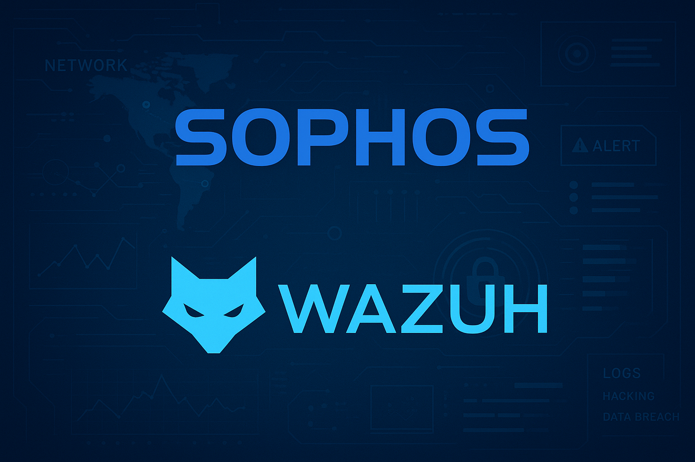

# Integração Wazuh & Sophos Central API



Integração completa entre Wazuh SIEM e Sophos Central API para coletar alertas e eventos de segurança automaticamente.
Projeto baseado inicialemente no repositório: https://github.com/guilhermesferreira/Wazuh-Integration-Sophos-Central-API-SIEM porém melhorias foram feitas.

## 📋 O Que Esta Integração Faz

- ✅ Coleta automática de **eventos** e **alertas** da Sophos Central API
- ✅ **+25 regras customizadas** para processar dados Sophos no Wazuh
- ✅ Mapeamento com **MITRE ATT&CK Framework**
- ✅ Suporte para múltiplos produtos Sophos (Endpoint, Firewall, Email, Web, IPS, etc)
- ✅ Sistema de cursor persistente (evita duplicação de dados)

---

## 🚀 Instalação Rápida

### Pré-requisitos

- Wazuh Manager instalado e rodando
- Python 3 instalado
- Credenciais da API Sophos Central (Client ID e Client Secret)

> 💡 **Nota:** O Tenant ID não é fornecido no portal da Sophos. Use o script `setup_credentials.py` para obtê-lo automaticamente.

### Passo 1: Obter Credenciais da Sophos

1. Acesse **Sophos Central > Global Settings > API Credentials**
2. Crie uma credencial com papel **"Service Principal SIEM"**
3. Anote o **`Client ID`** e **`Client Secret`** gerados

⚠️ **IMPORTANTE:** O portal da Sophos **NÃO fornece o Tenant ID** diretamente!  

**Opção A - Usar script automatizado (Recomendado):**

```bash
# Execute o script auxiliar que descobre o Tenant ID automaticamente
python3 setup_credentials.py
```

O script irá:
- Pedir Client ID e Client Secret
- Autenticar na API Sophos
- Descobrir automaticamente o Tenant ID via API `/whoami/v1`
- Detectar a região correta (BR, US, EU, etc)
- Criar o arquivo `.env` completo

**Opção B - Manual:**

Se preferir fazer manualmente, use este comando para descobrir o Tenant ID:

```bash
# Substitua CLIENT_ID e CLIENT_SECRET pelos seus valores
curl -X POST "https://id.sophos.com/api/v2/oauth2/token" \
  -H "Content-Type: application/x-www-form-urlencoded" \
  -d "grant_type=client_credentials&client_id=SEU_CLIENT_ID&client_secret=SEU_CLIENT_SECRET&scope=token" \
  | jq -r '.access_token' > token.txt

curl -X GET "https://api.central.sophos.com/whoami/v1" \
  -H "Authorization: Bearer $(cat token.txt)" \
  | jq .

# O campo "id" é o seu Tenant ID
# O campo "apiHosts.dataRegion" é o seu Data Host
```

### Passo 2: Instalar no Wazuh Manager

```bash
# 1. Instalar dependência Python
# Ubuntu/Debian:
sudo apt install python3-dotenv -y

# Amazon Linux/RHEL/CentOS:
sudo dnf install python3-pip -y
sudo -u wazuh pip3 install --user python-dotenv
# (ou sudo -u ossec pip3 install --user python-dotenv)

# 2. Copiar script para o Wazuh
sudo cp get_sophos_data.py /var/ossec/wodles/
sudo chmod +x /var/ossec/wodles/get_sophos_data.py

# 3. Configurar credenciais
sudo nano /var/ossec/wodles/.env
```

**Conteúdo do arquivo `/var/ossec/wodles/.env`:**

```env
SOPHOS_CLIENT_ID="seu_client_id_aqui"
SOPHOS_CLIENT_SECRET="seu_client_secret_aqui"
SOPHOS_TENANT_ID="seu_tenant_id_aqui"
SOPHOS_API_AUTH_HOST="id.sophos.com"
SOPHOS_API_DATA_HOST="api.central.sophos.com"
```

**⚠️ Importante:** Use o endpoint correto para sua região:
- **Global:** `api.central.sophos.com`
- **Brasil:** `api-br01.central.sophos.com`
- **US:** `api-us01.central.sophos.com`
- **EU:** `api-eu01.central.sophos.com`

```bash
# 4. Ajustar permissões
# Para instalações com usuário 'wazuh':
sudo chown wazuh:wazuh /var/ossec/wodles/get_sophos_data.py
sudo chown wazuh:wazuh /var/ossec/wodles/.env
sudo chmod 600 /var/ossec/wodles/.env

# Para instalações com usuário 'ossec':
sudo chown ossec:ossec /var/ossec/wodles/get_sophos_data.py
sudo chown ossec:ossec /var/ossec/wodles/.env
sudo chmod 600 /var/ossec/wodles/.env

# 5. Criar arquivos de log e cursor
sudo touch /var/log/sophos-api.log
sudo touch /var/ossec/wodles/sophos_cursor_events.txt
sudo touch /var/ossec/wodles/sophos_cursor_alerts.txt

# Ajustar proprietário (use wazuh ou ossec conforme seu sistema)
sudo chown wazuh:wazuh /var/log/sophos-api.log
sudo chown wazuh:wazuh /var/ossec/wodles/sophos_cursor_*.txt
```

### Passo 3: Configurar `ossec.conf`

Edite `/var/ossec/etc/ossec.conf` e adicione **dentro de `<ossec_config>`**:

```xml
<!-- Integração Sophos Central API -->
<localfile>
  <log_format>json</log_format>
  <location>/var/log/sophos-api.log</location>
</localfile>

<wodle name="command">
  <disabled>no</disabled>
  <tag>sophos_alerts</tag>
  <command>/usr/bin/python3 /var/ossec/wodles/get_sophos_data.py alerts</command>
  <interval>5m</interval>
  <ignore_output>no</ignore_output>
  <run_on_start>yes</run_on_start>
  <timeout>60</timeout>
</wodle>

<wodle name="command">
  <disabled>no</disabled>
  <tag>sophos_events</tag>
  <command>/usr/bin/python3 /var/ossec/wodles/get_sophos_data.py events</command>
  <interval>5m</interval>
  <ignore_output>no</ignore_output>
  <run_on_start>yes</run_on_start>
  <timeout>60</timeout>
</wodle>
```

### Passo 4: Adicionar Regras Customizadas

Copie o conteúdo de `local_rules.xml` para `/var/ossec/etc/rules/local_rules.xml` (dentro da tag `<group>`).

### Passo 5: Validar e Reiniciar

```bash
# Validar configuração
sudo /var/ossec/bin/wazuh-control configtest

# Reiniciar Wazuh Manager
sudo systemctl restart wazuh-manager
```

---

## 🔍 Validar se Está Funcionando

### 1. Verificar Execução dos Wodles

```bash
# Ver se os wodles estão sendo executados
sudo tail -f /var/ossec/logs/ossec.log | grep -i sophos
```

**Você deve ver linhas como:**
```
INFO: wazuh-modulesd:command: INFO: Starting command 'sophos_events'.
INFO: wazuh-modulesd:command: INFO: Starting command 'sophos_alerts'.
```

### 2. Verificar Coleta de Dados

```bash
# Ver eventos coletados em tempo real
sudo tail -f /var/log/sophos-api.log

# Contar total de eventos coletados
sudo wc -l /var/log/sophos-api.log

# Ver últimos eventos
sudo tail -20 /var/log/sophos-api.log
```

### 3. Verificar Estado dos Cursores

```bash
# Ver cursor de events
cat /var/ossec/wodles/sophos_cursor_events.txt

# Ver cursor de alerts
cat /var/ossec/wodles/sophos_cursor_alerts.txt
```

### 4. Testar Processamento de Regras

```bash
# Testar uma linha do log com wazuh-logtest
sudo head -1 /var/log/sophos-api.log | sudo /var/ossec/bin/wazuh-logtest
```

**Você deve ver uma regra Sophos sendo aplicada** (ex: Rule 110001, 110002, etc)

### 5. Ver no Wazuh Dashboard

1. Acesse o **Wazuh Dashboard**
2. Vá em **Threat Hunting** ou **Security Events**
3. Adicione filtro: `rule.groups: sophos`
4. Você verá os eventos da Sophos sendo exibidos!

**Filtros úteis:**
```
rule.groups: sophos
rule.groups: sophos AND rule.level >= 7
data.severity: high
data.type: Event::Endpoint::*
```

---

## 📊 Produtos Sophos Suportados

As regras customizadas cobrem eventos de:

- 🛡️ **Intercept X** (Endpoint Protection)
- 🔥 **Firewall** (Network Security)
- 📧 **Email Security** (Anti-phishing, Anti-malware)
- 🌐 **Web Control** (URL filtering)
- 🚨 **IPS** (Intrusion Prevention)
- 📁 **FIM** (File Integrity Monitoring)
- 🔐 **Device Encryption**
- 📱 **Application Control**
- 🌍 **DNS Protection**

---

## ⚙️ Arquitetura

```
┌─────────────────────┐
│  Sophos Central API │
│  • id.sophos.com    │
│  • api-XX.central...│
└──────────┬──────────┘
           │ OAuth 2.0
           │ X-Tenant-ID
           ↓
┌─────────────────────┐
│  Wazuh Manager      │
│  ┌────────────────┐ │
│  │ get_sophos_    │ │
│  │   data.py      │ │
│  └────────┬───────┘ │
│           ↓         │
│  /var/log/         │
│   sophos-api.log   │
│           ↓         │
│  Logcollector      │
│  (JSON parser)     │
│           ↓         │
│  Analysis Engine   │
│  (+25 regras)      │
│           ↓         │
│  Wazuh Dashboard   │
└─────────────────────┘
```

**Fluxo:**
1. Wodle executa `get_sophos_data.py` a cada 5 minutos
2. Script autentica com OAuth 2.0 na Sophos API
3. Busca eventos/alertas usando cursor persistente
4. Salva dados em `/var/log/sophos-api.log` (JSON)
5. Wazuh processa com regras customizadas
6. Alertas aparecem no Dashboard com MITRE ATT&CK

---

## 🔧 Troubleshooting

### Problema: Nenhum evento sendo coletado

**Verificar:**
```bash
# Testar script manualmente
sudo -u wazuh bash -c "cd /var/ossec/wodles && python3 get_sophos_data.py events"
# (ou sudo -u ossec bash -c ...)

# Ver erros
sudo tail -50 /var/ossec/logs/ossec.log | grep -i error

# Verificar credenciais
sudo cat /var/ossec/wodles/.env
```

### Problema: Erro de autenticação

**Soluções:**
- Verifique se Client ID, Client Secret e Tenant ID estão corretos
- Verifique se o Data Host é o correto para sua região
- Use o endpoint `/whoami/v1` para descobrir o Tenant ID e região corretos

### Problema: Caracteres acentuados incorretos

**Já corrigido nesta versão!** O script agora usa `encoding='utf-8'` e `ensure_ascii=False`.

Se ainda tiver problemas, verifique se o `local_rules.xml` está com encoding UTF-8.

### Problema: Erro "ModuleNotFoundError: No module named 'dotenv'"

**Solução:**
```bash
# Ubuntu/Debian:
sudo apt install python3-dotenv -y

# Amazon Linux/RHEL:
sudo -u wazuh pip3 install --user python-dotenv
# ou globalmente: sudo pip3 install python-dotenv
```

### Problema: Eventos não aparecem no Dashboard

**Verificar:**
```bash
# 1. Logs estão sendo coletados?
sudo ls -lh /var/log/sophos-api.log

# 2. Wazuh está lendo o arquivo?
sudo grep "sophos-api.log" /var/ossec/logs/ossec.log

# 3. Regras estão ativas?
sudo grep "110001" /var/ossec/etc/rules/local_rules.xml

# 4. Testar processamento
sudo head -1 /var/log/sophos-api.log | sudo /var/ossec/bin/wazuh-logtest -v
```

---

## 📁 Estrutura do Projeto

```
.
├── get_sophos_data.py       # Script principal de coleta
├── setup_credentials.py     # ⭐ Script auxiliar para criar .env
├── local_rules.xml          # +25 regras customizadas
├── ossec.conf               # Configuração do Wazuh (exemplo)
├── env.example              # Template de configuração
├── COMANDOS_VALIDACAO.md    # Comandos de validação
├── images/                  # Imagens do README
│   └── readme-banner.png
└── README.md                # Este arquivo
```

---

## 🔑 Configuração Avançada

### Ajustar Intervalo de Coleta

No `ossec.conf`, modifique a tag `<interval>`:

```xml
<interval>5m</interval>   <!-- Padrão: 5 minutos -->
<interval>10m</interval>  <!-- Ou 10 minutos -->
<interval>1h</interval>   <!-- Ou 1 hora -->
```

### Ajustar Limite de Eventos

No `get_sophos_data.py`, linha 73:

```python
params = {'limit': 1000}  # Padrão: 1000 (máximo permitido)
params = {'limit': 200}   # Mínimo: 200
```

**Nota:** A Sophos API exige que `limit` seja entre 200 e 1000.

### Rotação de Logs

Configure logrotate para `/var/log/sophos-api.log`:

```bash
sudo tee /etc/logrotate.d/sophos-api << 'EOF'
/var/log/sophos-api.log {
    daily
    rotate 7
    compress
    delaycompress
    missingok
    notifempty
    create 0644 wazuh wazuh
    postrotate
        systemctl reload wazuh-manager > /dev/null 2>&1 || true
    endscript
}
EOF
```

---

## 📊 Regras Incluídas

| ID | Descrição | Severidade |
|----|-----------|------------|
| 110001 | Base Sophos (decoder) | 3 |
| 110002 | Endpoint Update Success | 0 |
| 110003 | Endpoint Update Reboot Required | 3 |
| 110004 | Endpoint Threat Detected | 10 |
| 110005 | Endpoint Malware Cleaned | 7 |
| 110006 | Email Malware/Phishing | 8 |
| 110007 | Web Block (malicious) | 5 |
| 110008 | Firewall ATP Detection | 9 |
| 110009 | IPS Attack Blocked | 9 |
| 110010 | FIM - File Modified | 7 |
| ... | +15 regras adicionais | ... |

**Todas as regras incluem:**
- Categorização por tipo de evento
- Mapeamento MITRE ATT&CK
- Níveis de severidade apropriados
- Grupos para filtragem

---

## 🌍 Suporte Multi-Região

A integração detecta automaticamente a região do seu tenant Sophos.

**Regiões suportadas:**
- 🇧🇷 Brasil (BR01)
- 🇺🇸 Estados Unidos (US01, US02, US03)
- 🇪🇺 Europa (EU01, EU02)
- 🌏 Outros (consulte documentação Sophos)

**Para descobrir sua região automaticamente:**

```bash
# Obter informações do tenant
curl -X GET "https://api.central.sophos.com/whoami/v1" \
  -H "Authorization: Bearer SEU_TOKEN"
```

---

## 📝 Monitoramento

### Script de Monitoramento Rápido

```bash
#!/bin/bash
echo "=== Status Integração Sophos + Wazuh ==="
echo ""
echo "Status Wazuh Manager:"
systemctl status wazuh-manager --no-pager | head -3
echo ""
echo "Últimas execuções:"
tail -50 /var/ossec/logs/ossec.log | grep -i sophos | tail -5
echo ""
echo "Eventos coletados:"
if [ -f /var/log/sophos-api.log ]; then
    echo "  Total: $(wc -l < /var/log/sophos-api.log) linhas"
    echo "  Tamanho: $(du -h /var/log/sophos-api.log | cut -f1)"
else
    echo "  ⚠️ Arquivo não encontrado"
fi
echo ""
echo "Cursores:"
echo "  Events: $(cat /var/ossec/wodles/sophos_cursor_events.txt 2>/dev/null | cut -c1-50)..."
echo "  Alerts: $(cat /var/ossec/wodles/sophos_cursor_alerts.txt 2>/dev/null | cut -c1-50)..."
```

### Comandos Úteis

```bash
# Ver coleta em tempo real
sudo tail -f /var/log/sophos-api.log

# Ver logs do Wazuh
sudo tail -f /var/ossec/logs/ossec.log | grep -i sophos

# Forçar execução manual
sudo -u wazuh bash -c "cd /var/ossec/wodles && python3 get_sophos_data.py events"

# Ver alertas gerados
sudo grep "sophos" /var/ossec/logs/alerts/alerts.log | tail -20

# Estatísticas
sudo wc -l /var/log/sophos-api.log
sudo du -h /var/log/sophos-api.log
```

---

## 🆘 FAQ

### Como descobrir o Tenant ID correto?

⭐ **IMPORTANTE:** O portal da Sophos **não mostra o Tenant ID** quando você cria as credenciais!

**Solução Fácil (Recomendado):**

Execute o script auxiliar incluído neste projeto:

```bash
python3 setup_credentials.py
```

O script irá:
1. Pedir seu Client ID e Client Secret
2. Autenticar automaticamente
3. Descobrir o Tenant ID via API `/whoami/v1`
4. Detectar a região correta (BR01, US01, EU01, etc)
5. Criar o arquivo `.env` completo e pronto para usar

**Solução Manual:**

Use a API `/whoami/v1` após autenticar. O campo `id` retornado é o Tenant ID correto (veja comandos curl no Passo 1 do README).

### A API exige limite mínimo?

Sim, entre **200 e 1000** eventos por requisição.

### Como saber se está coletando dados?

Verifique se o arquivo `/var/log/sophos-api.log` está sendo atualizado:

```bash
sudo stat /var/log/sophos-api.log
```

A data de modificação deve ser recente (últimos 5-10 minutos).

### Usuário é `wazuh` ou `ossec`?

Depende da sua instalação do Wazuh. Verifique com:

```bash
id wazuh  # Se retornar informações, use wazuh
id ossec  # Se retornar informações, use ossec
```

---

## 📚 Referências

- [Sophos Central API Documentation](https://developer.sophos.com/)
- [Sophos SIEM API v1](https://developer.sophos.com/docs/siem-v1/1/overview)
- [Wazuh Documentation](https://documentation.wazuh.com/)
- [MITRE ATT&CK Framework](https://attack.mitre.org/)

---

## 📄 Licença

Este projeto é fornecido "como está", sem garantias. Use por sua conta e risco.

---

## 🤝 Contribuições

Contribuições são bem-vindas! Sinta-se à vontade para:
- Reportar bugs
- Sugerir melhorias
- Adicionar novas regras
- Melhorar a documentação

---

**Desenvolvido para:** Wazuh Manager + Sophos Central API  
**Testado em:** Ubuntu 24.04, Amazon Linux 2023  
**Última Atualização:** Novembro 2025
